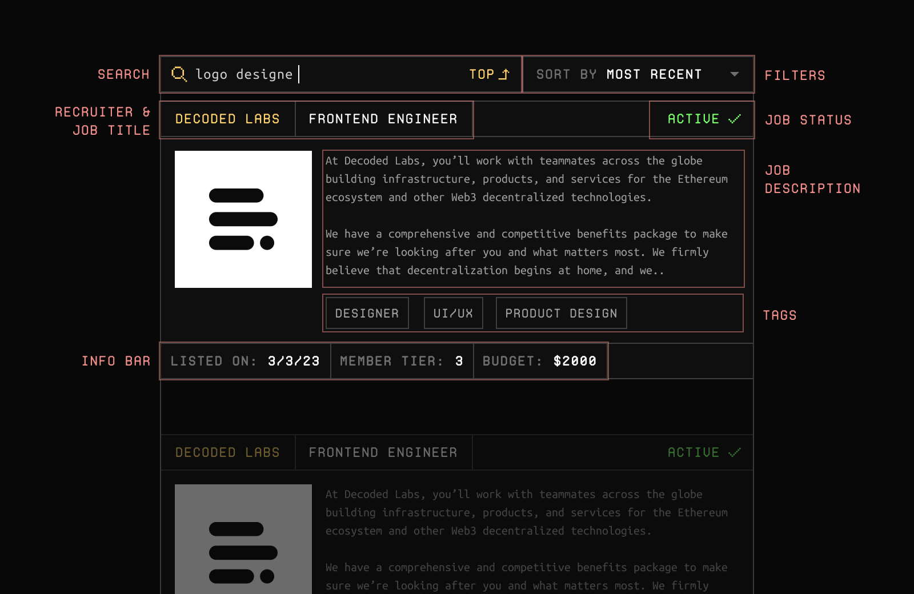
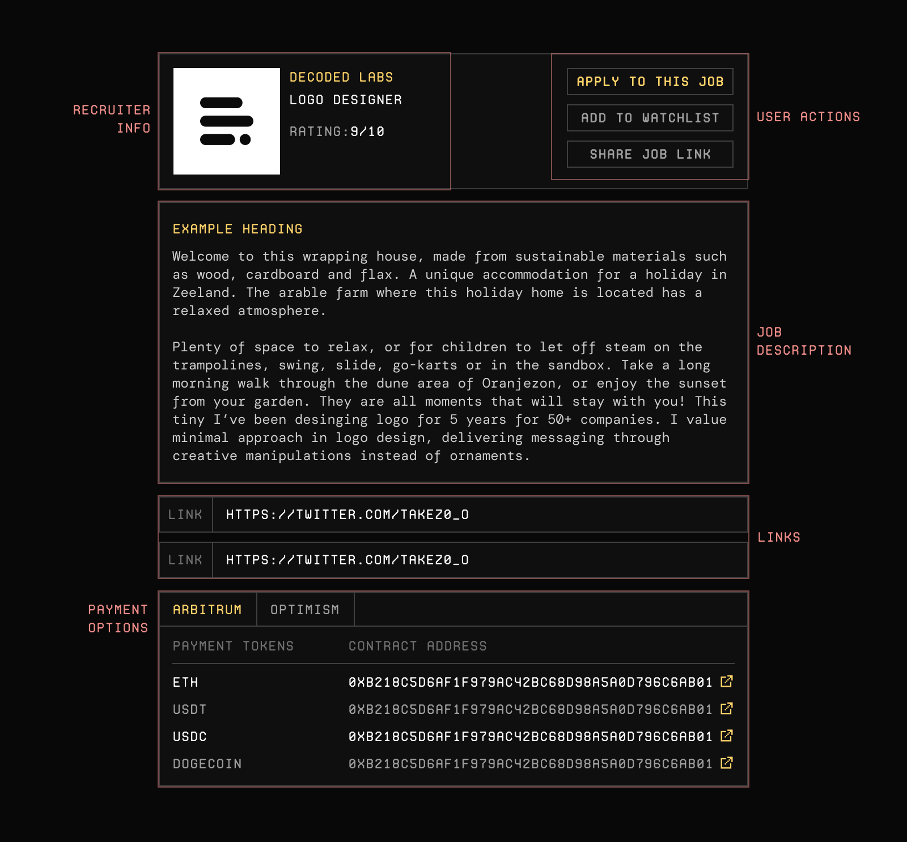

# Jobs Feed
Jobs page has a 2-column layout. On the left, you'll find the jobs with involving all the
job listings. On the right, you'll find the details for the currently selected job listing.

## Feed Section
Feed section is for browsing new job listings. You may use the search bar or sorting to further advance your search. 

Each job post on the feed will have the same look. 

- At the top of the listing, you'll find the recruiter company/person's
name, job's title and the status. Jobs get finalized and marked "Taken" when an on-chain agreement references it.
- At the middle, you'll see a short snippet of the job description and tags.
- At the bottom, you'll find listing date, member info and the budget for the job.

## Details Section
Details section is for all the what-nots of the job listing. You can scroll on this area to see all of the details.

- At the top of the details section, you'll find recruiter info and actions.
- At the middle you'll find a lengthy description and related links.
- At the bottom, you'll find list of tokens recruiter accepts to pay in.
