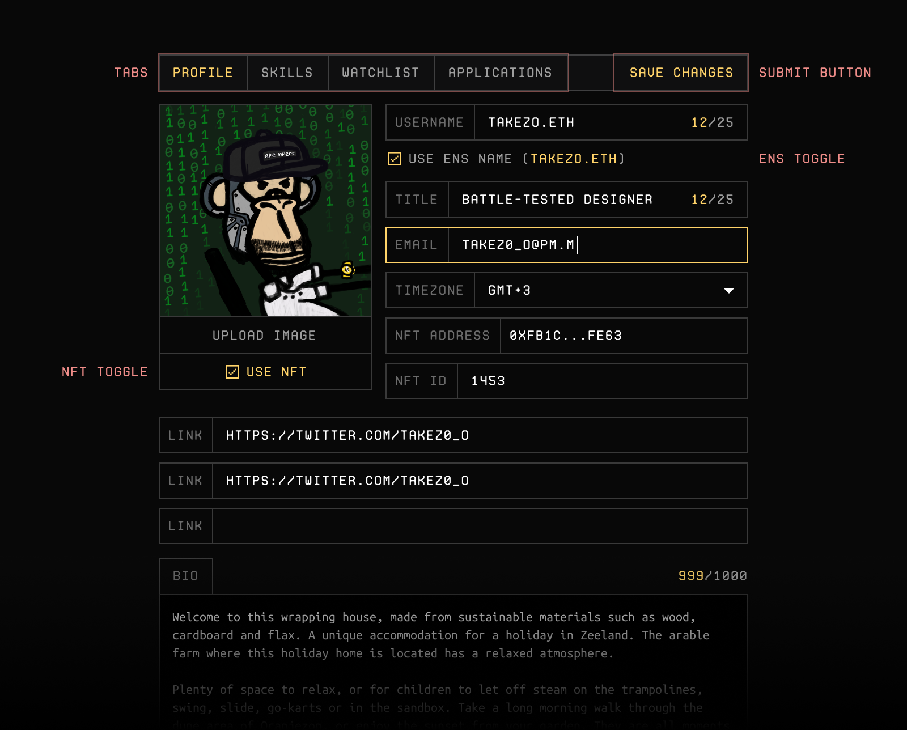

# Updating Profile
Use profile page to edit your profile, post new skills, check your watchlist, favorites or applications.

On the profile page, you'll find 5 different tabs at the top bar;
- Profile
- Skills
- Watchlist
- Favorites
- Applications

HonestWork profiles are custom-tailored for the web3 freelancer. There are three things you may want to pay close attention to;
1. You can use your ENS name instead of a custom username.
2. You can use an NFT of yours instead of uploading a profile picture.
3. Don't forget to toggle "Receive private messages" to get messages/offers using XMTP.

When you're done, you can check your profile page (from a visitors perspective) by visiting *honestwork.app/profile/[**your_wallet_address**]*.
