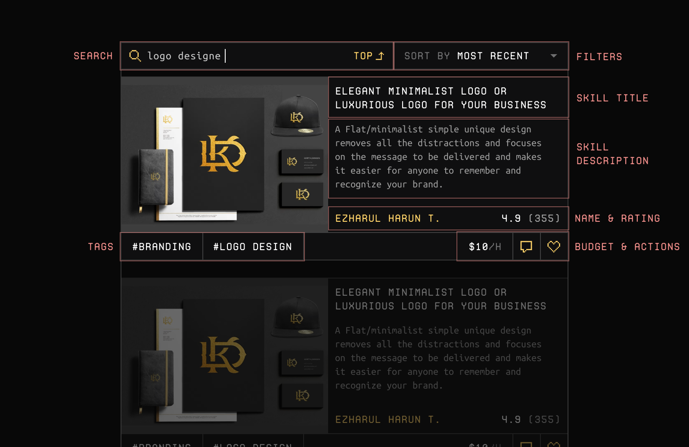

# Skills Feed
Skills page has a 2-column layout. On the left, you'll find all the public skills HonestWork creators created on the
platform. On the right, you'll find the details for the currently selected skill.

## Feed Section
Feed section is for browsing new skills. You may use the search bar or sorting to further advance your search. 

Each skills on the feed will have the same look. 

- On the left side of the skill card, you'll find the first image attached to the post.
- On the right, you'll find skill title, description, and creator name and rating.
- At the bottom, you'll find tags of left, budget, send message button and like button.

## Details Section
Details section is for all the what-nots of the selected skills. You can scroll on this area to see all of the details.

- At the top, you'll find creator name and title.
- In the middle, you'll find the image gallery which takes up to 8 images.
- Finally, description and external links follow.
